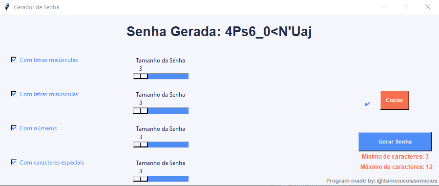

# Gerador-de-senhas

Um aplicativo gráfico simples para gerar senhas seguras e personalizadas, desenvolvido em Python com Tkinter.

## Funcionalidades

- Geração de senhas com letras maiúsculas, minúsculas, números e caracteres especiais.
- Controle do tamanho da senha para cada tipo de caractere (mínimo 3, máximo 12).
- Interface gráfica amigável.
- Botão para copiar a senha gerada para a área de transferência.
- Mensagens explicativas e feedback visual.

## Captura de Tela




### Dependências

- `tkinter` (já incluso na maioria das instalações do Python)
- `pyperclip` (Necessário instalação direto do prompt de comando)

## Como usar

1. Execute o script principal:
   ```sh
   python "gerador de senha_1.0.py"
   ```
2. Marque as opções desejadas (maiúsculas, minúsculas, números, caracteres especiais).
3. Ajuste o tamanho de cada tipo de caractere usando os sliders.
4. Clique em **Gerar Senha**.
5. Clique em **Copiar** para copiar a senha gerada.

## Personalização

- Você pode alterar as cores e textos diretamente no arquivo Python para adaptar à sua preferência.
- O limite de caracteres pode ser ajustado modificando os parâmetros dos sliders.

## Futuras Atualizações

- Planejo implementar uma interface ainda mais moderna e personalizável utilizando a biblioteca [CustomTkinter](https://github.com/TomSchimansky/CustomTkinter).
- Novas opções de personalização para as senhas.
- Melhorias na usabilidade e acessibilidade da interface.
  
## Autor

Feito por [Nicolas Dias](https://github.com/NicolasDias19)  
Instagram: [@itsmenicolasvinicius](https://instagram.com/itsmenicolasvinicius)

Sinta-se à vontade para contribuir ou sugerir melhorias!
